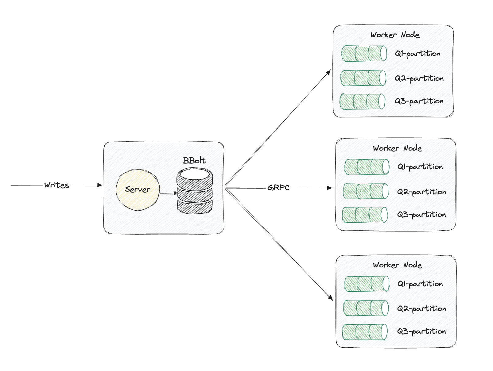

# SQ Design Doc

### Table of Contents
- [SQ Design Doc](#sq-design-doc)
    - [Table of Contents](#table-of-contents)
  - [SQ](#sq)
    - [Introduction](#introduction)
    - [Design Goals](#design-goals)
    - [Architecture](#architecture)
      - [Components](#components)
      - [Data Flow](#data-flow)
    - [Implementation Details](#implementation-details)
      - [Server](#server)
      - [Worker Nodes](#worker-nodes)
      - [Communication](#communication)
    - [Consistency and Reliability](#consistency-and-reliability)
    - [Performance Considerations](#performance-considerations)
    - [Deployment](#deployment)

## SQ

### Introduction
SQ is a lightweight distributed append-only log designed to provide at-least-once delivery semantics. It emphasizes operational simplicity, reliability, and performance.

### Design Goals
- **Operational Simplicity**: Easy to deploy, operate, and maintain, especially in Kubernetes environments.
- **Reliability**: Inspired by Apache Cassandra and Project Ray, SQ is designed to be robust and fault-tolerant.
- **Performance**: Written in Go and leveraging gRPC for communication, SQ is built with performance in mind.
- **Semantic Guarantees**: Follows Kafka-like semantics with at-least-once delivery.
- **Consistency**: Strongly consistent by default, with configurable consistency levels.

### Architecture

#### Components
- **Server**: Central component managing writes and coordinating worker nodes.
- **BBolt**: Embedded key-value store used by the server for persistent storage.
- **Worker Nodes**: Handle partitions of the log, ensuring data is processed and delivered.
- **gRPC**: Communication protocol between the server and worker nodes.

#### Data Flow
1. **Writes**: Incoming data is written to the server.
2. **Storage**: Server uses BBolt to store data.
3. **Distribution**: Server distributes data to worker nodes via gRPC.
4. **Processing**: Worker nodes handle partitions and ensure delivery semantics.

### Implementation Details

#### Server
- Manages incoming writes.
- Uses BBolt for storage.
- Distributes log data to worker nodes.

#### Worker Nodes
- Handle specific partitions of the log.
- Ensure at-least-once delivery semantics.
- Communicate with the server via gRPC.

#### Communication
- **gRPC**: Used for communication between the server and worker nodes.

### Consistency and Reliability
- **Strong Consistency**: Default mode ensures data is consistent across the system.
- **Configurable Levels**: Different consistency levels can be configured based on use case requirements.
- **Fault Tolerance**: Inspired by Apache Cassandra and Project Ray, ensuring high reliability and fault tolerance.

### Performance Considerations
- **High Throughput**: Designed to handle high write and read throughput.
- **Low Latency**: Optimized for low-latency operations using Go and gRPC.

### Deployment
- **Kubernetes**: Designed with Kubernetes in mind for easy deployment and scalability.
- **Operational Simplicity**: Emphasis on ease of deployment and maintenance.
- **Scalability**: Easily scalable by adding more worker nodes to handle increased load.
